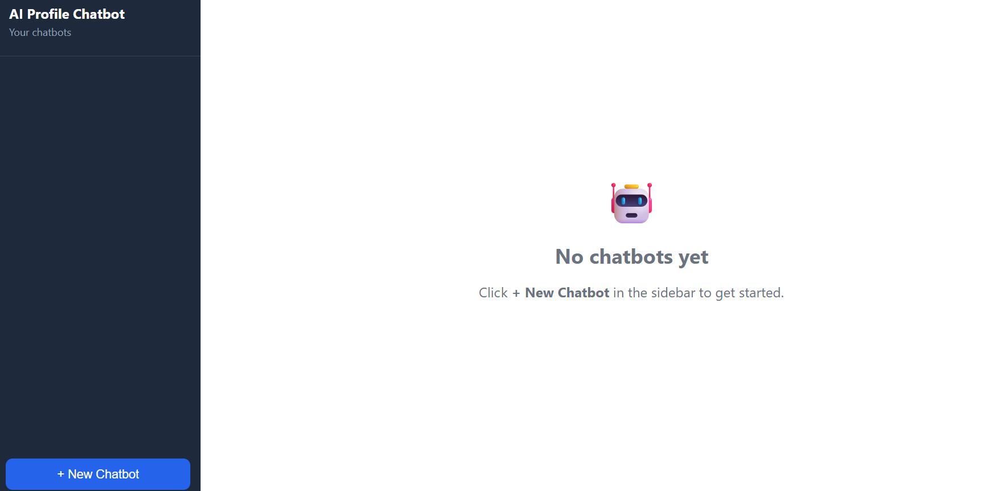
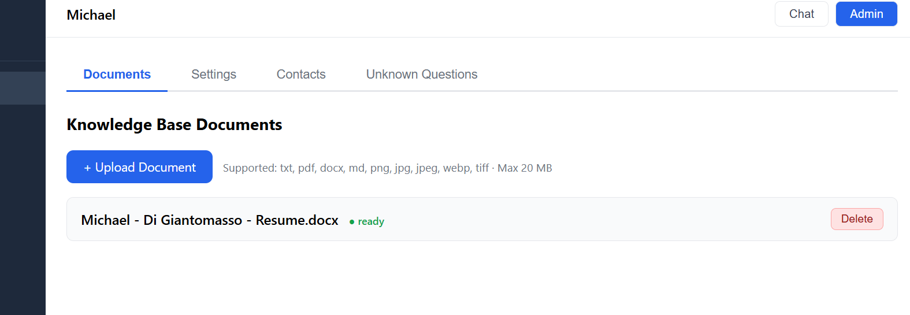
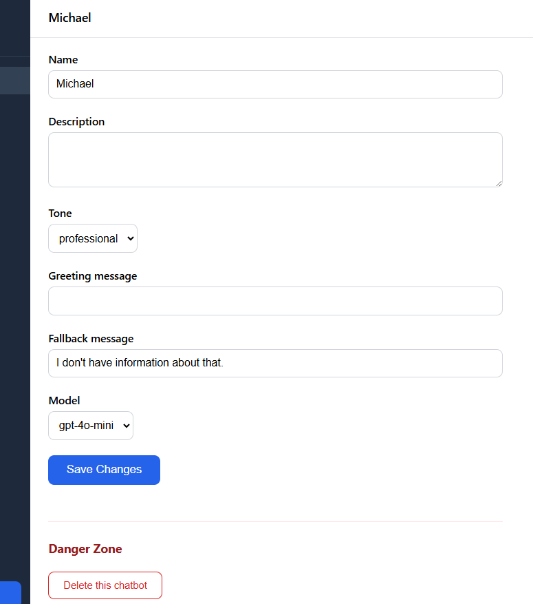
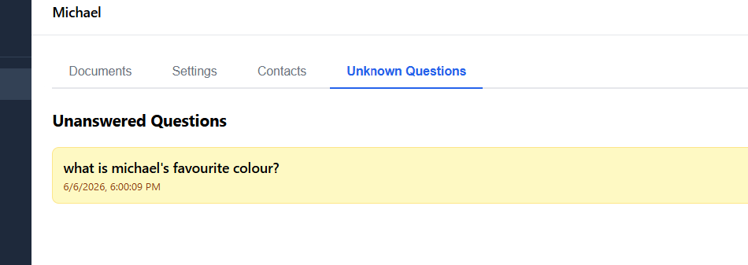

# AI Profile Chatbot

A multi-tenant SaaS platform where anyone can upload their own documents and generate an AI chatbot that represents them — answering questions about their background, experience, and expertise.

## Screenshots

### Home Page
The landing screen when no chatbots have been created yet. The dark sidebar lists all your chatbots and includes a **+ New Chatbot** button to get started.



---

### Admin — Documents Tab
The Documents tab inside the Admin panel. This is where you upload files to build the chatbot's knowledge base. Supported formats include PDF, DOCX, TXT, MD, and images. Each document shows its processing status — once marked **ready**, the chatbot can retrieve from it during conversations.



---

### Admin — Settings Tab
The Settings tab lets you configure the chatbot's name, description, tone, greeting message, fallback message (shown when the bot can't answer), and the underlying OpenAI model. The Danger Zone at the bottom allows permanent deletion of the chatbot and all its data.



---

### Admin — Unknown Questions Tab
The Unknown Questions tab logs every question a visitor asked that the chatbot couldn't answer from its knowledge base. Each entry shows the question and the timestamp. This gives you a clear view of gaps in your uploaded content so you can add more documents to address them.



## What It Does

- **Multi-chatbot management** — Create and manage multiple chatbots, each with their own documents, settings, and chat history.
- **Document ingestion** — Upload PDF, TXT, MD, and DOCX files. Content is chunked, embedded, and stored in a vector database for retrieval.
- **RAG-powered chat** — Each response is grounded in retrieved context from the chatbot's knowledge base, with source citations.
- **Contact capture** — Records visitor name and email when they express interest in connecting.
- **Unknown question logging** — Saves questions the bot can't answer, visible in the admin dashboard.
- **Quality control loop** — Every response is evaluated; if rejected, the bot rewrites before sending.
- **Admin dashboard** — Upload documents, edit chatbot settings, view contacts, and review unanswered questions.
- **Streaming chat** — Responses stream in real time.

## Technologies

- **Python 3.11+** / **FastAPI** — backend API
- **React + TypeScript + Vite** — frontend
- **OpenAI GPT-4o-mini** — chat + evaluation
- **OpenAI text-embedding-3-small** — document embeddings
- **ChromaDB** — vector store (local, persistent)
- **SQLAlchemy + SQLite** — relational data (swappable to PostgreSQL via `DATABASE_URL`)
- **pypdf / python-docx** — document parsing
- **pytest** — backend test suite (77 tests)

## Getting Started

### Prerequisites

- Python 3.11+
- Node.js 18+
- OpenAI API key

### Installation

```bash
git clone https://github.com/mdg888/Career-Conversations.git
cd Career-Conversations
```

**Backend:**

```bash
cd backend
python -m venv venv
source venv/bin/activate  # Windows: venv\Scripts\activate
pip install -r requirements.txt
```

**Frontend:**

```bash
cd frontend
npm install
```

### Environment Variables

Copy `.env.example` to `.env` and fill in your values:

```bash
cp .env.example .env
```

```
OPENAI_API_KEY=your-key
DATABASE_URL=sqlite:///./data/app.db   # or postgresql://...
DATA_DIR=./data
```

### Run the App

**Backend** (from `backend/`):

```bash
uvicorn src.api.main:app --reload --port 8000
```

**Frontend** (from `frontend/`):

```bash
npm run dev
```

Frontend runs at `http://localhost:5173`, backend API at `http://localhost:8000`.

### Docker

```bash
docker-compose up --build
```

App available at `http://localhost:8000`.

### Migrate Existing Profile (optional)

If you have a `me/profile_summary.pdf` and `me/summary.txt` from the original single-person chatbot, run:

```bash
python migrate_existing_profile.py
```

This creates a default chatbot and ingests those files (idempotent — safe to run multiple times).

### Run Tests

```bash
cd backend
pytest
pytest --cov=src
```

## Project Structure

```
Career-Conversations/
├── backend/
│   ├── src/
│   │   ├── api/          # FastAPI routes (chatbots, chat, documents)
│   │   ├── services/     # ChatService, DocumentService, EmbeddingService, VectorStore
│   │   ├── models/       # Pydantic + ORM models
│   │   ├── db/           # SQLAlchemy engine + session
│   │   └── core/         # Config, tool registry
│   ├── tests/            # 77 tests
│   └── requirements.txt
├── frontend/
│   └── src/
│       ├── components/
│       │   ├── Chat/     # ChatInterface, MessageBubble, SourceCitations
│       │   └── Admin/    # Dashboard, DocumentUpload, ChatbotSettings, ContactCaptures
│       └── services/     # API client
├── .env.example
├── docker-compose.yml
└── migrate_existing_profile.py
```

## API Reference

| Method | Path | Description |
|--------|------|-------------|
| `POST` | `/api/chatbots` | Create chatbot |
| `GET` | `/api/chatbots/{id}` | Get chatbot |
| `PUT` | `/api/chatbots/{id}` | Update chatbot |
| `DELETE` | `/api/chatbots/{id}` | Delete chatbot + all data |
| `POST` | `/api/chatbots/{id}/chat` | Send a message |
| `POST` | `/api/chatbots/{id}/documents` | Upload a document |
| `GET` | `/api/chatbots/{id}/documents` | List documents |
| `DELETE` | `/api/chatbots/{id}/documents/{doc_id}` | Delete document |
| `GET` | `/api/chatbots/{id}/contacts` | List captured contacts |
| `GET` | `/api/chatbots/{id}/unknown-questions` | List unanswered questions |

## Troubleshooting

- **OpenAI errors** — check `OPENAI_API_KEY` and usage limits.
- **ChromaDB errors** — ensure `DATA_DIR` is writable.
- **Database errors** — check `DATABASE_URL` and that the data directory exists.
- **Document processing fails** — only PDF, TXT, MD, and DOCX are supported (max 20 MB).
